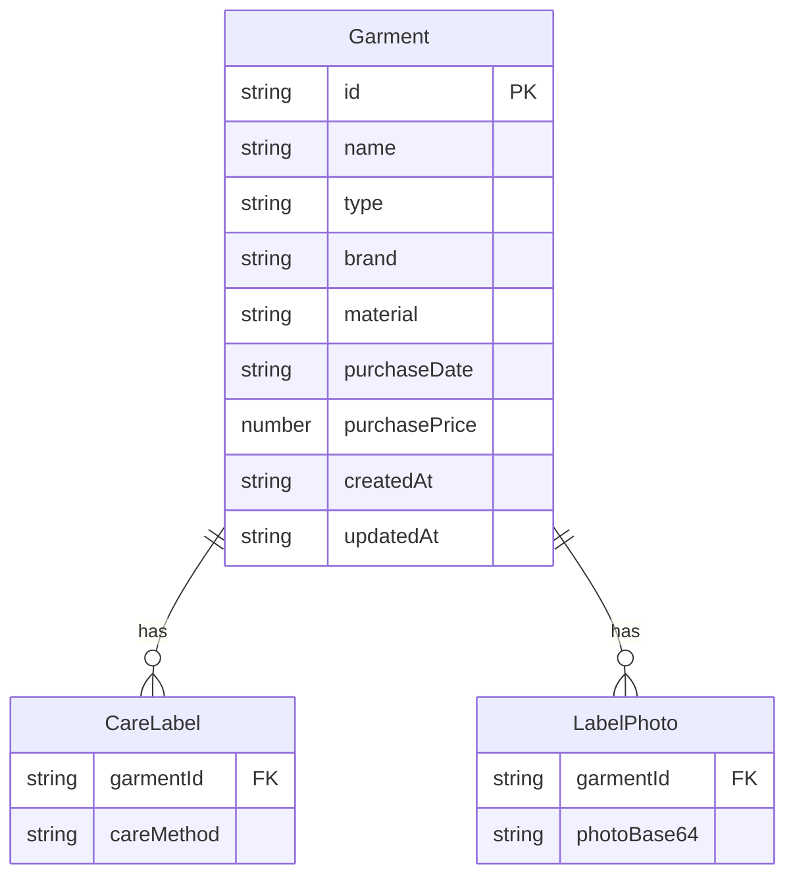

## 1. 架构设计

```mermaid
flowchart TD
    "前端 React SPA" --> "LocalStorage 持久化"
    "前端 React SPA" --> "浏览器摄像头 API"
    "前端 React SPA" --> "Canvas 图片压缩"
    "LocalStorage 持久化" --> "衣物数据 JSON"
    "LocalStorage 持久化" --> "标签照片 Base64"
```

## 2. 技术说明
- 前端：React@18 + TailwindCSS@3 + Vite
- 初始化工具：Vite (React + TypeScript 模板)
- 后端：无（纯前端应用）
- 数据库：LocalStorage（浏览器本地存储）
- 图片处理：Canvas API 压缩 + FileReader Base64 编码
- 摄像头：navigator.mediaDevices API（可选，降级为文件选择）

## 3. 路由定义
| 路由 | 用途 |
|------|------|
| / | 衣物列表页，展示所有已录入衣物 |
| /garment/:id | 衣物详情页，展示单件衣物完整信息 |
| /add | 录入页，新增衣物 |
| /edit/:id | 编辑页，编辑已有衣物信息 |

## 4. API 定义
无后端 API。数据通过自定义 Hook 封装 LocalStorage 操作。

### 数据操作接口（useGarments Hook）
```typescript
interface Garment {
  id: string;
  name: string;
  type: GarmentType;
  brand: string;
  material: Material;
  purchaseDate: string;
  purchasePrice: number;
  careMethods: CareMethod[];
  labelPhotos: string[];
  createdAt: string;
  updatedAt: string;
}

type GarmentType = '衣服' | '裤子' | '外套' | '毛衣' | '裙子' | '内衣' | '其他';
type Material = '羊毛' | '真丝' | '棉' | '聚酯纤维' | '亚麻' | '牛仔' | '皮革' | '混纺' | '其他';
type CareMethod = '水洗' | '干洗' | '水温≤30°' | '不可漂白' | '不可烘干' | '低温熨烫' | '中温熨烫' | '高温熨烫';

// CRUD 操作
addGarment(garment: Omit<Garment, 'id' | 'createdAt' | 'updatedAt'>): void
updateGarment(id: string, garment: Partial<Garment>): void
deleteGarment(id: string): void
getGarmentById(id: string): Garment | undefined
getAllGarments(): Garment[]
searchGarments(query: string): Garment[]
filterGarments(type?: GarmentType, material?: Material): Garment[]
```

## 5. 服务器架构
无服务器架构，纯前端 SPA 应用。

## 6. 数据模型

### 6.1 数据模型定义


### 6.2 LocalStorage 键定义
| 键名 | 类型 | 描述 |
|------|------|------|
| garment-care:garments | Garment[] | 所有衣物数据 |
| garment-care:photos:{id} | string[] | 单件衣物的标签照片 Base64 数组 |

## 7. 关键技术实现

### 7.1 图片压缩策略
- 使用 Canvas 将拍摄/选择的图片缩放至最大宽度 800px
- JPEG 质量设为 0.6，控制单张照片在 500KB 以内
- 压缩后转为 Base64 存储

### 7.2 洗护方式图标映射
| 洗护方式 | 图标描述 |
|----------|----------|
| 水洗 | 水盆图标 |
| 干洗 | 圆圈+P图标 |
| 水温≤30° | 温度计+30图标 |
| 不可漂白 | 三角形+叉号 |
| 不可烘干 | 方框+叉号 |
| 低温熨烫 | 熨斗+1点 |
| 中温熨烫 | 熨斗+2点 |
| 高温熨烫 | 熨斗+3点 |

### 7.3 预置数据
- 衣物类型：衣服、裤子、外套、毛衣、裙子、内衣、其他
- 材质选项：羊毛、真丝、棉、聚酯纤维、亚麻、牛仔、皮革、混纺、其他
- 洗护方式：水洗、干洗、水温≤30°、不可漂白、不可烘干、低温熨烫、中温熨烫、高温熨烫
